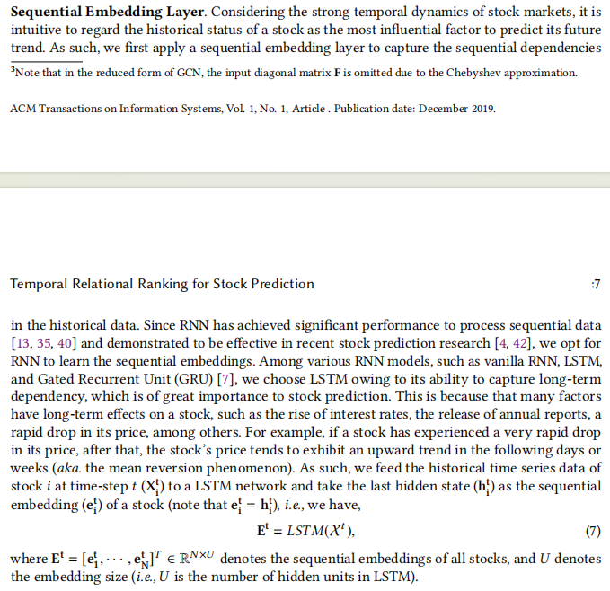
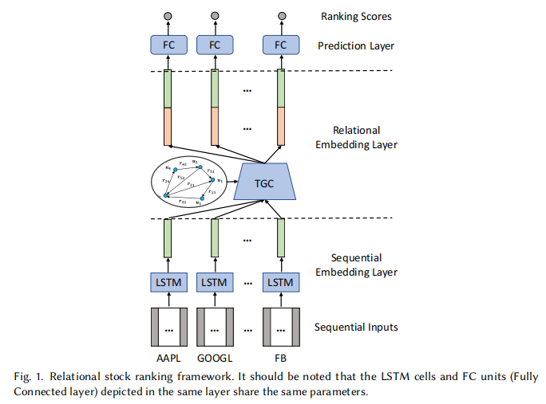
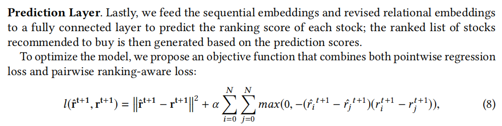

# DL-intro-2

### 数据预处理

见`preprocessing.ipynb`

在我看到网上的各种股票预测模型或者别的案例中，样本都进行了归一化，所以我感觉这样是有必要的。常见的归一化有最大-最小归一化和z-score归一化，我这里采用z-score归一化因为预测的样本里可能有超出原有最小、最大范围内的数据。因此我的处理是：

- 去掉有缺失值的行；
- 再对0-299号匿名特征做z-score归一化，并且记录每一号特征的均值和方差，记录在字典中并保存在/output文件夹中。

### Network_1

对于stock2vec这种embedding，我看到常见的做法是LSTM，具体的实现细节尚不明晰。我觉得我搜到的一篇文章（恰好是中科大的paper）的做法有一定参考价值，链接在这[论文](https://arxiv.org/pdf/1809.09441.pdf)，对应的[github仓库](https://github.com/fulifeng/Temporal_Relational_Stock_Ranking)，b站视频链接[在这](https://www.bilibili.com/video/BV1a54y1o77U)，根据b站评论区，这个LSTM模型是训练好的，然后把每个股票的时序信息喂进去取最后一个隐藏状态。论文片段如下：

感觉LSTM拿来做embedding是蛮靠谱的。我那边进展不太行也许会来做一下network_1。

8/15晚更新：训练成功，大概10个epochs左右，现在就想调整一下embedding size，并且尽快写一个脚本看看预测的状况，感觉还不太好写。训练的代码在`exp4`文件夹中，测试的脚本还未成熟就暂且不上传。暂时跑出了一个embedding的`embeddings_dict.npy`文件存放在`output`文件夹中，特征向量维数为8，但感觉小了，后面改换别参数跑跑试试，这个只是一个初步的embedding，感觉不太靠谱。初次搭建，今晚再检查一下训练脚本的合理性，自己加一些注释，尤其是后面embedding那一块儿，毕竟prompt编程已成习惯。

### Network_2

model2训练的代码在`exp3`文件夹中，具体情况见`network2.md`，简言之进展不佳。但是捣腾许久综合来看搞这个network必要性并不是很大。下次更新时详细说明这一点，后续可能会做一些network1或者其他的工作。

- 均值都很接近零，反应不了什么问题；
- 目前我看到的资料都是将time_id作为时序信息，相当于在network1中就用到了，况且最终检验的一些time_id还是我们训练集没有的。network1的做法反而很常见。

### Network_4

我找过不少资料，我认为损失函数的选择可以使用MSE+ $\alpha$ 排名损失。在上面的同一篇论文中的描述如下（论文中默认值为1）：

我对于network4的想法确实不多，主要是觉得训练的数据首先要归一化处理；其次是损失函数可以参考这篇论文的做法。

## 一些点：

- 关于最终的预测脚本：
  - step 1 给所有数据归一化，每个特征的变换与预处理的变换一致；
  - step 2 判断预测的类型，比如判断这个股票在训练集里出现过没有。我们原有的模型是有embedding的，我们可以考虑训练两个模型？
  - step 3 预测。
